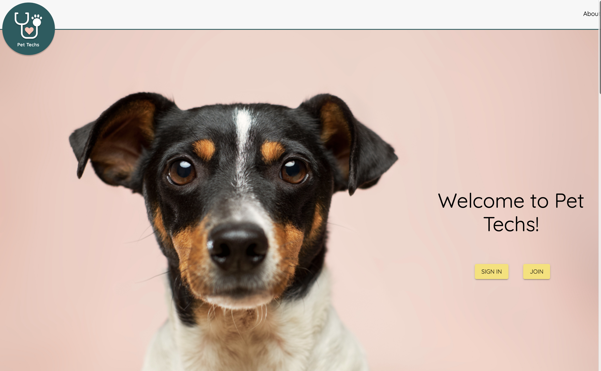
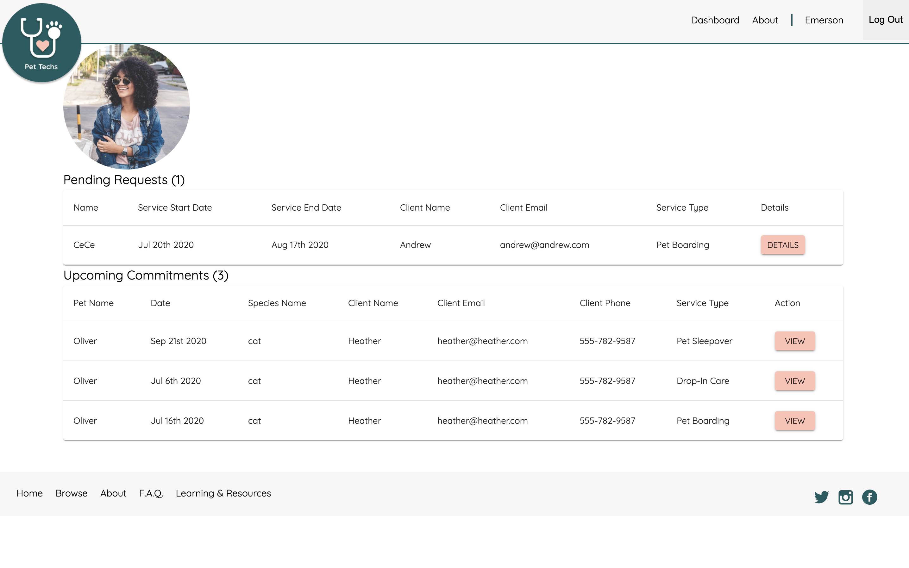
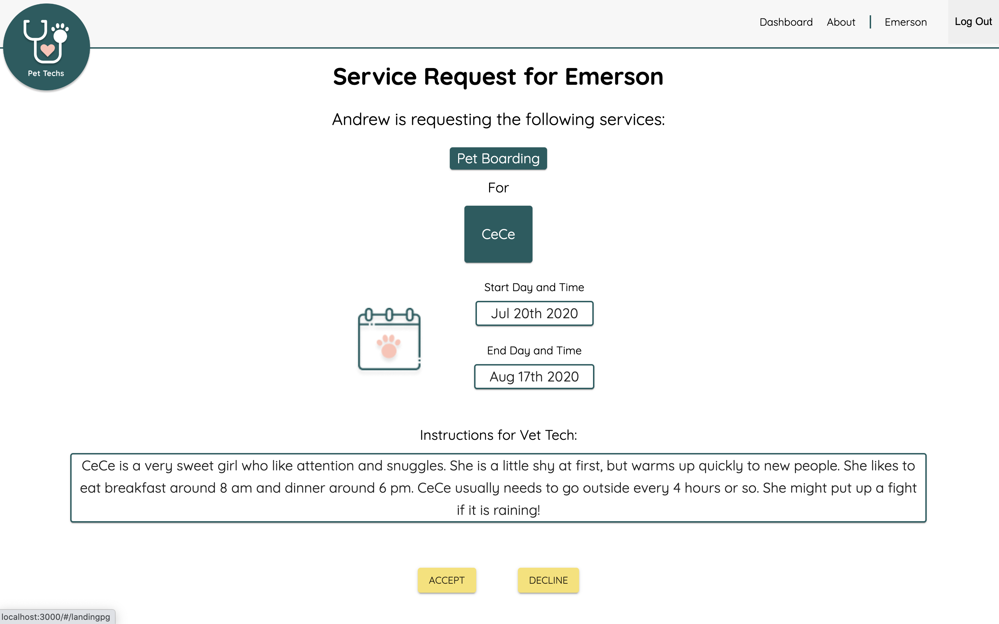

# Pet-Techs

Duration: 2 Week Sprint

## Problem and Solution

Pet Techs was created to help bridge the gap between certified Vet Tech's and pet owners to help provide different out-of-clinic care for their animals. With how important Vet TEchs are in our pets world, it is important that we are able to provide them with professional veterinary technician care outside of routine clinic care.

Our client has been a Vet Tech for almost 10 years and would receive calls daily asking if they provided pet sitting services and other types of services. This is where Pet Techs comes in to bridge that gap. This allows Pet Techs to continue doing something they are passionate about, gain more experience under their belts, as well as offer peace of mind to the pet owner.

Pet Techs is here to provide more experienced care then just a local neighborhood girl. Pet Techs can provide individuals who have experience with senior, special needs, diabetic, animal first aid and CPR and other knowledge and expertise to ensure your pet is getting the best care possible when going on that business trip.

## 






## Application walk through

### Pet Owner Walk Through

We will get started from the pet owners side of the application. Upon loading the page, we can see an overview of what Pet Techs is and what they can offer pet owners, and veterinary technicians. We will start by clicking Join. Here the user will input all their information such as email, username, phone number, a password to protect their account, how they heard about Pet Techs and will want to select the "sign up as pet owner" radio button and click Register.

The next page will be used to collect all the personal information of the individual signing up. This info will include an address, a bio about their animals, a bio about their animals preferred toys, a bio about their home environment and be able to upload a photo of themselves to their profile. The user will also be able to input emergency contact information and their preferred vet clinic in the event the vet needs to transfer their animal to a vet.

The next page will be all the input information for the pet owners' pets. This information will contain items such as the type of pet, the name, weight, age and other demographics for the animal. The user will also be able to input important information such as feeding, medication, behavioral, and care equipment about their pet.

Once complete the pet owner can review all their info and fix any information that may be wrong. If everything looks good to the pet owner they can click complete and this will redirect them to their dashboard. From the dashboard the pet owner can view their pets care plan, as well as search for services.

When the user clicks find a service they will be taken to a list of all vet techs that are members of the site. From here they can filter their needs to better find someone to suit what they are looking for. Once the pet owner finds someone to fit their needs, they can click View Profile to get a better understanding of the Vet Tech and their experience, qualifications and the preferences of the service that Vet Tech provides.

If everything looks the pet owner can then click request service and they will be redirected to the service request page. This is where the user can input information about their pet, and select what services they are looking for, as well as set the date span that they are requesting services. After completing this form the user will be notified that an email has been sent to the selected vet tech and be redirected to their dashboard where they can see their pending service request, as well as any accepted service request and declined service request.

If the user needs to edit any info in their pets care plan they can do so by clicking the care plan in their dashboard for the selected animal. Here the pet owner can update any food, medical, or general information about the pet. This information will also be reflected in the care plan that the Vet Tech will have access to.

After submitting their request, the pet owner can continue on with their day while waiting to hear from the Vet Tech.

### Vet Tech Walk Through

Starting from the Vet Techs side of the application we will see that upon loading the page, we can see an overview of what Pet Techs is and what they can offer pet owners, and veterinary technicians. We will start by clicking Join. Here the user will input all their information such as email, username, phone number, a password to protect their account, how they heard about Pet Techs and will want to select the "sign up as Vet Tech" radio button and click Register.

Signing up as a Vet Tech is a little more thorough as they have more options to choose and set. On the registration page the Vet Tech will be able to enter demographic information such as name, address, and add a photo to their profile. They will also be able to select which services they would like to serve. These can be updated after the Vet Tech signs up using the edit profile function in their profile.

After clicking save and continue, the Vet Tech will be brought to a page of questions where they can more closely talk about the services they can provide. This is information about the type of pet they are willing to take care of, when they are available, the size of the animal they are comfortable and a few other important questions regarding the Vet Techs preferences.

After saving their responses, the Vet Tech will be asked to provide some more information regarding years of experience, current job title, degrees and certifications, areas of expertise and a short bio about themselves. The Vet Tech will also be asked some more questions regarding their ability to administer medication, cpr or animal first aid, experience watching special needs animals or senior animals, and if they are able to provide diabetic and insulin care.

After clicking continue the Vet Tech will have a chance to review all their information that they provided and also be able to make any changes if need be. After clicking complete the Vet Tech will be brought to their dashboard. This is where their pending service request will be displayed, as well as any upcoming commitments they have that they have already accepted.

Looking at the pending request section of the dashboard the user will be able to click Details to view more information regarding the service request. The details will display the type of service requested, the dates selected for the services, and additional information for the Vet Tech that comes from the input of the pet owners service request. If the Vet Tech likes the service request and wants to provide services they can click accept and the request will be moved to the upcoming commitments section of the dashboard. Alternatively if they don't feel it's a good fit for them the Pet Tech can click decline.

Once the Vet Tech clicks Accept they can view the service request in their upcoming commitments section of their dashboard. Here the Vet Tech will be able to view information such as the type of service, type of animal, pet and owner name, as well as contact information for the pet owner. The Vet Tech will also be able to click Details and see the care plan that was provided from the pet owner when they originally signed up. This care plan is the main source of instructions for the Vet Tech during the Service.

The Vet Tech can also navigate to their profile from the Navigation Bar and view their profile and make any edits. Using the Edit My Profile button the Vet Tech will be able to change the services that the Vet Tech offers, as well as update any new information they may want to display to pet owners.

This wraps up Pet Techs walk through. We hope this can give you a better understanding of how the web application works.

Thanks for checking out Pet Techs Web Application!

## Download (Don't Clone) This Repository

- Don't Fork or Clone. Instead, click the `Clone or Download` button and select `Download Zip`.
- Unzip the project and start with the code in that folder.
- Create a new GitHub project and push this code to the new repository.

## Prerequisites

Before you get started, make sure you have the following software installed on your computer:

- [Node.js](https://nodejs.org/en/)
- [PostrgeSQL](https://www.postgresql.org/)
- [Nodemon](https://nodemon.io/)

This version uses React, Redux, Express, Passport, and PostgreSQL (a full list of dependencies can be found in `package.json`).

## Create database and table

Create a new database called `pet_techs` and create the tables found in the database.sql file.

If you would like to name your database something else, you will need to change `pet_techs` to the name of your new database name in `server/modules/pool.js`

## Development Setup Instructions

- Run `npm install`
- Create a `.env` file at the root of the project and paste this line into the file:
  ```
  SERVER_SESSION_SECRET=superDuperSecret
  IAM_USER_KEY=yourkeyhere
  IAM_USER_SECRET=yourkeyhere
  BUCKET_NAME=yourbucketnamehere
  SENDGRID_API_KEY=yourkeyhere
  SENDGRID_FROM_EMAIL=youremailhere
  ```
  While you're in your new `.env` file, take the time to replace `superDuperSecret` with some long random string like `25POUbVtx6RKVNWszd9ERB9Bb6` to keep your application secure. Here's a site that can help you: [https://passwordsgenerator.net/](https://passwordsgenerator.net/). If you don't do this step, create a secret with less than eight characters, or leave it as `superDuperSecret`, you will get a warning.
- Start postgres if not running already by using `brew services start postgresql`
- Run `npm run server`
- Run `npm run client`
- Navigate to `localhost:3000`

## Production Build

Before pushing to Heroku, run `npm run build` in terminal. This will create a build folder that contains the code Heroku will be pointed at. You can test this build by typing `npm start`. Keep in mind that `npm start` will let you preview the production build but will **not** auto update.

- Start postgres if not running already by using `brew services start postgresql`
- Run `npm start`
- Navigate to `localhost:5000`

## Lay of the Land

- `src/` contains the React application
- `public/` contains static assets for the client-side
- `build/` after you build the project, contains the transpiled code from `src/` and `public/` that will be viewed on the production site
- `server/` contains the Express App
- `routes/` contains all the routes you will need on the back end to sync with your database.

## Deployment

1. Create a new Heroku project
1. Link the Heroku project to the project GitHub Repo
1. Create an Heroku Postgres database
1. Connect to the Heroku Postgres database from Postico
1. Create the necessary tables
1. Add an environment variable for `SERVER_SESSION_SECRET` with a nice random string for security
1. In the deploy section, select manual deploy

## Authors

- Thy Christiansen
- Mike Cossalter
- Natalie Hummel
- Chinmaya Pulikallu
- Heather Stoffels

## Thank you

- Vicky Moffat - Founder of Pet Techs
- Dane Smith - instructor at Prime Digital Academy
- Dev Jana - instructor at Prime Digital Academy
- Lamport Cohort - July 2020

## Update Documentation

Customize this ReadMe and the code comments in this project to read less like a starter repo and more like a project. Here is an example: https://gist.github.com/PurpleBooth/109311bb0361f32d87a2
